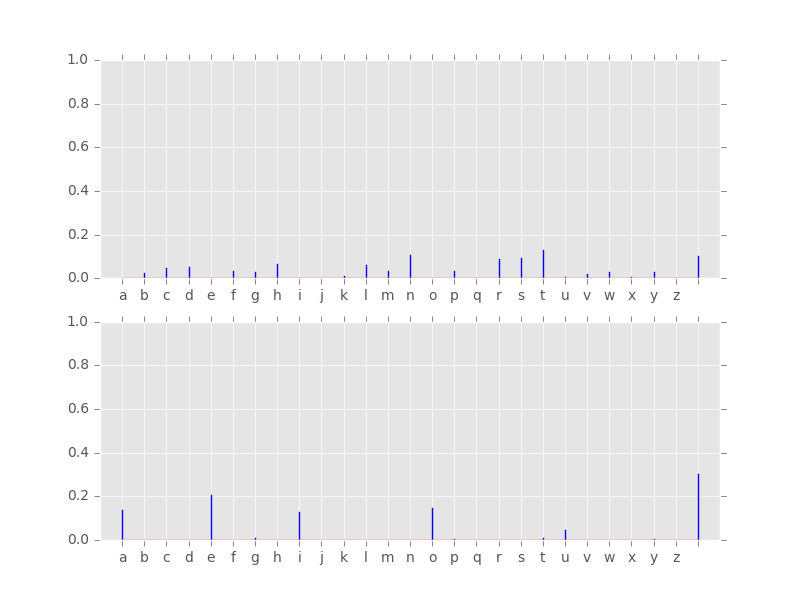

# hidden-markov-model

A [Cython](http://cython.org/) implementation of [HMM](https://en.wikipedia.org/wiki/Hidden_Markov_model) traning (the Baum-Welch algorithm).

Also present a test script, using a toy corpus (some articles scraped from [TNW](http://thenextweb.com/), it learns a model (2 hidden states versus 27 observable states).

